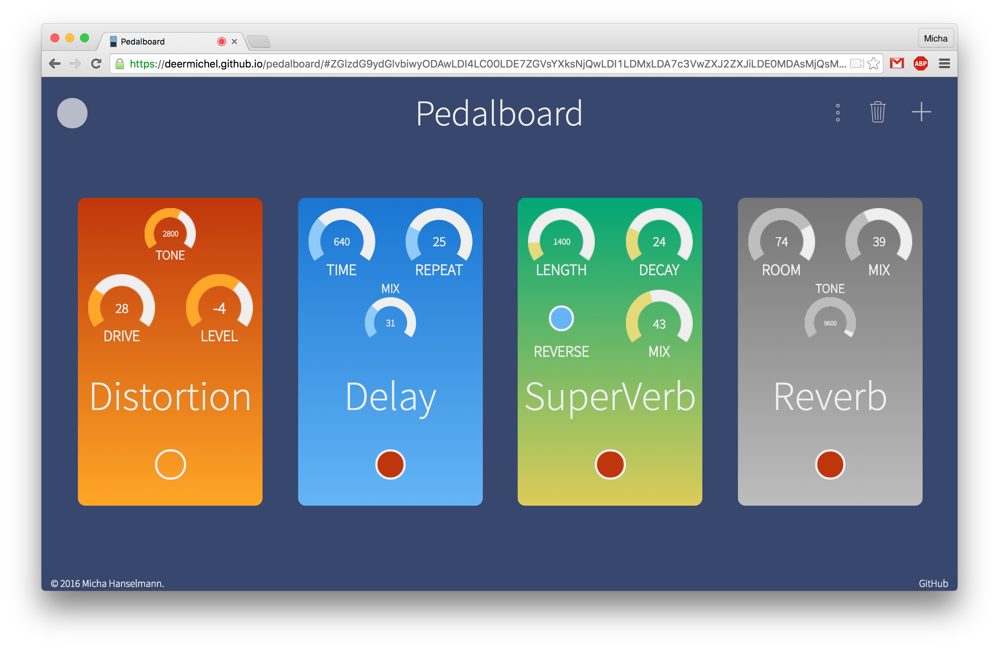
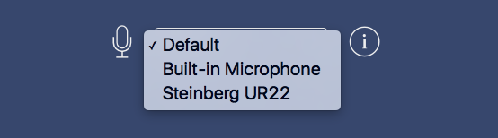

## Pedalboard

This is Pedalboard, a web live audio manipulation experiment.
Connect your guitar or mic to your computer using an audio interface.
Depending on your software and hardware configuration, there might be a
noticeable latency (remember - it's an experiment). For best results use
Google Chrome. *(To be honest, Chrome is the only browser supporting all
features without problems.* :smirk:*)*

[](https://deermichel.github.io/pedalboard/#ZGlzdG9ydGlvbiwyODAwLDI4LC00LDE7ZGVsYXksNjQwLDI1LDMxLDA7c3VwZXJ2ZXJiLDE0MDAsMjQsMSw0MywwO3JldmVyYiw3NCw5NjAwLDM5LDA%3D)

### How-to

Visit the [site](https://deermichel.github.io/pedalboard/) with Chrome.
If your computer is connected to multiple inputs, select the one you want
to use and start monitoring by clicking on the play button.
*(Be aware of feedback when using the internal microphone!)*



The header bar displaying the main functions will appear. If you click on
the **plus** icon, all available pedals will be shown. You can add one of these
by clicking on it. A click on the **trash bin** icon switches Pedalboard into
delete mode. In this mode, pedals can be removed with a click. To return
to normal mode, click the icon again. The **three dots** icon expands the menu.
The **round button** on the left is used for recording. Press it to start and
press it again to stop the recording. Then feel free to download or publish it. :wink:


Using the pedals is quite straightforward. Change their parameters by pulling
the knobs or scroll on them. To work extra precisely, enter the value manually.
The red button let you bypass the pedal. Furthermore, the pedals can be reordered
with drag and drop.

### Third-party

* [jQuery](https://jquery.com/) ([MIT](https://github.com/jquery/jquery/blob/master/LICENSE.txt))
* [jQuery Knob](http://anthonyterrien.com/knob/) ([MIT](https://github.com/aterrien/jQuery-Knob/blob/master/LICENSE))
* [Tone.js](https://github.com/Tonejs/Tone.js) ([MIT](https://github.com/Tonejs/Tone.js/blob/master/LICENSE.md))
* [SoundCloud SDK](https://developers.soundcloud.com/) ([License](https://github.com/soundcloud/soundcloud-javascript/blob/master/LICENSE.md))
* [Recorder.js](https://github.com/mattdiamond/Recorderjs) ([MIT](https://github.com/mattdiamond/Recorderjs#license-mit))
* [Dropbox.js](https://github.com/dropbox/dropbox-js) ([MIT](https://github.com/dropbox/dropbox-js/blob/stable/LICENSE.txt))
* [qr.js](http://neocotic.com/qr.js/) ([GPL v3](https://github.com/neocotic/qr.js/blob/master/LICENSE.md))
* [Ionicons](http://ionicons.com/) ([MIT](https://github.com/driftyco/ionicons/blob/master/LICENSE))

### License

This project is released under the GNU GPL v3 License. (See [LICENSE](https://github.com/DeerMichel/pedalboard/blob/gh-pages/LICENSE) for more information.)

```
Pedalboard - Online guitar pedalboard
Copyright (c) 2016 Micha Hanselmann

This program is free software: you can redistribute it and/or modify
it under the terms of the GNU General Public License as published by
the Free Software Foundation, either version 3 of the License, or
(at your option) any later version.

This program is distributed in the hope that it will be useful,
but WITHOUT ANY WARRANTY; without even the implied warranty of
MERCHANTABILITY or FITNESS FOR A PARTICULAR PURPOSE.  See the
GNU General Public License for more details.

You should have received a copy of the GNU General Public License
along with this program.  If not, see <http://www.gnu.org/licenses/>.
```
